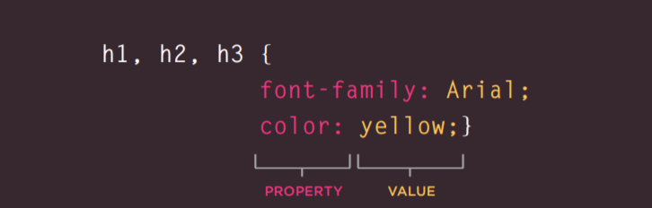

# Intro To HTML 
#### Text 
We have additional and differents ways to control or to show our text in a specified way. using differents tags, for example strong tag, br tag, hr tag, and (sup or sub) tags ... etc.

we use some tags to emphsize things or to make it bold or to write the power of a number or a date ... etc.

For example :
1. Headings
> h1, h2 , h3, h4, h5, h6.

2. Paragraph 
> We use p But between angled brackets. and the content of this para will be inside the p tag.

3. Superscript & Subscrip
>  it is used to raising numbers and for dates.
>  used with foot notes or chemical formulas 

# Intro to CSS

We are goinog to cover :
1. What Css dose? 
*It is represent the style of a web page.
2. How Css works, and how to link it with html doc? 
*It is working by linking CSS file to the HTML Doc*
3. Rules and properties and Values?
*We use selectors and properties and valuse in the css file to reflect its rules in html structure.

All of us know that CSS make our pages colorful, but how!.
Css do that using selectors for the elements from html and give it  properties and values.

# Basic intro to JS
#### Decisions and loops

Java script is programming lang. its role to make the web pages more interactive and dynamic, by typing series of instructions.
and it has many ways to link it with the html doc.

Decisions & looping

What we need to know is that there is some places where the decisions are made.
And we can use a flowchart to paln the differents events or occasions.

We need to understand some operators and how it does its work
like the comparison operartors... etc 

For more resources 
.[Get More](https://chris.beams.io/posts/git-commit/)
