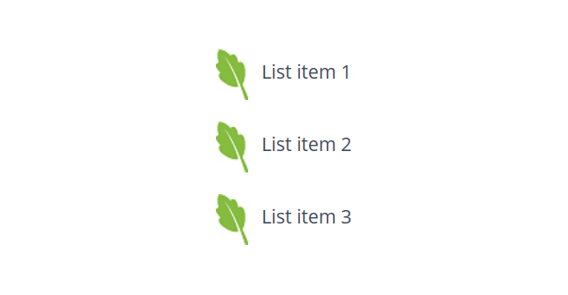

# Reading Notes
### Read 03

#### A Discussion about :

**- [ ] HTML Lists**

* **What are the lists in html?**

    *Html allows us to add to our web pages lists, there are two style of these lists, and you can choose one of them depending on your lists if it is ordered or not.* [^]
   - Numbered lists or ordered lists.
   - Bullet lists or unordered lists.
   - Definition lists
   - Nested lists

**Ordered lists:**
  when we intend to create an ordered list in html Doc we use <ol> element, and to close this element we need to close it with its closing tag </ol>.
  Now inside this element we can put our items and it is placed between opening and closing tag ( <li> </li>).
  meanwhile You can add an attribute to you list identifying the numbering style as numbers or letters ..etc.

**Unordered lists:**
The same as the ordered list we can creat unordered list in html doc, but here in this case the element we use is different a bit and indicate to not order this list or the ordered it is not matter.
The element is <ul> and we close it </ul>.
and each items inside this list is placed between the opening tag <li> and the closing tag </li>.

**Definition lists:**
The definition list is created with the <dl> element and usually consists of a series of terms and their definitions.
Now inside this list we will see pairs of <dt> and <dd>.  This element <dt>  is to contain the terms we need to define it. <dd> it is the container for the definition.. Now please guess what are the closing tags for the previous tags.. 

**Nested lists:**
It is used to put a list inside list or we can call it a sub list from an item following the main list.

**- [ ] HTML Boxes**

WE Need to know in this part of our reading [^]
*How to control the dimensions of boxes.*
  - width (px or percentages).
    * min-width indicates to the least width should the box start from.
    * max-width indicates to the maximum width can the box extended.
  - Height (px or precentages).
    * min-height indicates to the least height should the box start from.
    * max-height indicates to the maximum height can the box extended.
  - overflow property we use it if the content larger than our box and we
     have to choices (heddin, scroll).
 
*How to creat various border around boxes margin and padding.*
*Every box has three available properties that can be adjusted to control its appearance:*
  - border : we can control the border fetuersm fro example border width,
    border style, border-color.
  - Padding : every box has a margin inside it and this is the different 
    between it and the margin. And we can manage its dimentions like padding-top, padding-bottom, padding-right.

  - Margin : it is the area outside the border or around the box, we can 
    manage its dimentions in differnts ways.

**- [ ] JavaScript Basic Instructions**
Array
Array : Is a special type of the JS variables, it stores values, not just one value, list of values.
We consider using Array when we have many values related to each others, for example some items in shop center.
**Note:** Values in an array are accessed as if they are in a numbered list. It is important to know that the numbering of this list starts at zero (not one).
Example:
 var color;
     color = [red,
            orange,
            green;]

Now how to accecc an array and change its values, See this example:

**II Create the array**
var colors = ['white',
'black' ,
'custom'];

**Update the third item in the array**
colors[2] = 'beige ' ;

**Get the element with an id of colors**
var el = document .getElementByid(' colors') ;

**Replace with third item from the array** 
el .textContent = colors[2]; 