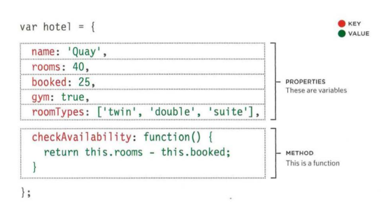
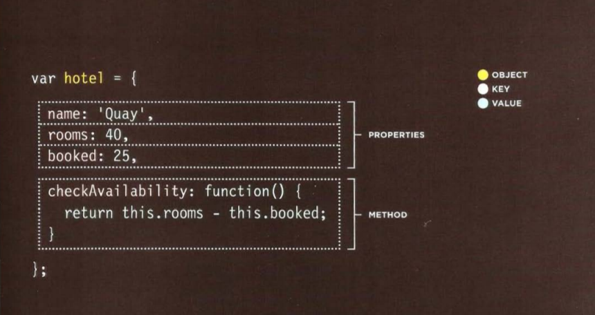

# Read06 
### Object literals
### Object Model

#### Object litrals 
In Javascript we use someting called Object, Obect is more detaild than the fanctions and the variables. The Object by itself is a set of functions and variables.
Each variable inside an object called a property, and each function inside an object called a method.

In the previous Example, The graphs illustrate the structure of an object, meanwhile the propertires and the methods have a name and valus, the name is called a key and the value is value for sure.

To creat an object there are several ways to do that, but the easeist and most popular way to creat objects is **Literal Notation.**
And the to creat an object is shown in the followin figure:

Now There are two ways to access an object:
1. using Dot Notation
2. Using square brackets

#### Document Object Model (DOM)

Dom It is not a part of HTML, nor Jscript, It is a set of rules excuted by all the browser nakers.
and it is covering two prime areas:
1. making a Model of HTML page.
when a browser loads a web page, it creates a model of the web page in the memory.
2. Accessing and changing the HTML page

As a browser loads a web page, it creates a model of that page.
The model is called a DOM tree, and it is stored in the browsers' memory.
It consists of four main types of nodes. 

**WORKING WITH THE DOM TREE**

* Locate the node that represents the element you want to work with.
* Use its text content, child elements, and attributes. 

 Accessing  The HTML elements by :
* Selectin an individual element node. 
And these are the codes we access an indivdual element by using it 
> get El ement Byld () this using id attribute.
> querySe 1 ector () uses css selector to access its properties.

* select multiple element (nodelists).  
> And this code to selelct all elements that have the same class name 
  getElementsByClassName().
> selecting all element by using a spesific tag name getElementsByTagName() 
> Uses css selector to access all the matching selectors
  querySelectorAll() 

* TRAVERSING BETWEEN ELEMENT NODES 

***Note to keep in mind:***
> the DOM is  working with a node that represents that element. 

**Cashing DOM Queries:**
*When your script needs to use the same element/s several times we save the location of this element/s or a reference in a variable so we will avoid the browser looknig for the same element trough the whole Tree.*

When a DOM method can return more than one element, it returns a Nodelist (even if it only finds one matching element). 

**There are two ways to select an element from a Nodelist:**
* The item() method. this will return an indivdual node from
  a Nodelist.
* Array syntax.
Both require the index number of the element you want.

Example: 
<var elements = document.getElementsByClassName('hot')
if (elements.length>= 1) {
var firstltem = elements.item(O);
}>

**Notes:**
* An element node can contain multiple text nodes andchild elements that are    siblings of each other.
* In older browsers, implementation of the DOM isinconsistent (and is a popular reason for using jQuery).
* Browsers offer tools for viewing the DOM tree.
