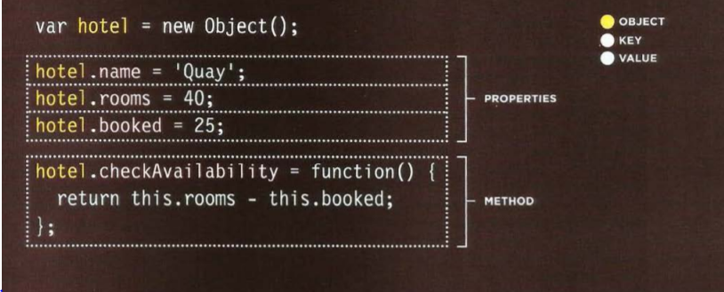
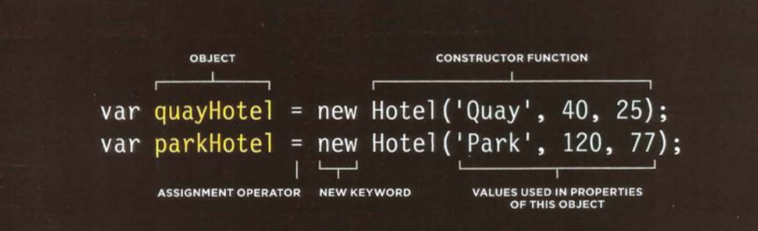

*Domain modeling is the process of creating aconceptual model in code for a specific problem. A modeldescribes the various entities, their attributes and behaviors, as well as the constraints that govern the problem domain. An entity that stores data in properties and encapsulates behaviors in methods is commonly referred to as an object-oriented model.*

*A domain model that's articulated well can verify and validate the understanding of a specific problem among various stakeholders. As a communication tool, it defines a vocabulary that can be used within and between both technical and business teams.*

Generate random numbers
To model the random nature of user behavior, you'll need the help of a random number generator. Fortunately, the JavaScript standard library includes a Math.random() function for just this sort of occasion.

**Summary**
Domain modeling is the process of creating a conceptual model for a specific problem. And a domain model that's articulated well can verify and validate your understanding of that problem.

Here's some tips to follow when building your own domain models.

* When modeling a single entity that'll have many instances, build self-contained objects with the  same attributes and behaviors.
* Model its attributes with a constructor function that defines and initializes properties.
* Model its behaviors with small methods that focus on doing one job well.
* Create instances using the new keyword followed by a call to a constructor function.
* Store the newly created object in a variable so you can access its properties and methods from outside.
* Use the this variable within methods so you can access the object's properties and methods from inside.

### HTML : Tables 

* How to creat tables in Html.
* What data goes into the tables.
* How to represent complex data in tables.

For what we use it :
It is summarizing a big and a complex data, in a well organized way, so we can read the data easily.
The table consist of rows and columns, each row has one cell or more, these cells represent the number of columns.
and we have Headers to be placed in the first row, and sometime we have more details to be placed on the first column.

To Build your own Table on the html document, You need to use the table tag (<table>), and inside it we start with (<tr>) tag, which is represent the firs row, inside the row we use the (<td>) tag, and this tag represent the number of cells within the first row, meanwhile, it represent the number of columns.

To insert a heading into the first row  we use (<th>).

**Note:**
> You can make cells of a table span more than one row
> or column using the rowspan and colspan attributes.

***We Have mentioned Before that we have two ways to create an object, the first one using the literal, and the second way using constructor notation.***
***To declare the proparites we use dot notation or square brackets***

Sometimes you will need several objects to represent similar things.
using the Object constructors can make the way much easier to do that. And it uses a function as a template for creating objects. at the end we get a blank objects, so we can add our properities into this object.
So we are creating a template with the object's properties and methods. 

* And here we use new as keyword 
* Now The (new) keyword followed by the call to the  function, creats a new object.
* The properities of an object are given as an areguments to the function.
* We need here to notice that We have two differents objects (The Name of the hotels), and one constructor function contains the same method. so both hotels will use the same constructor function with the same methods inside it.

**Note:**
* Arrays Of object, thats mean arrays can contain objects, and the oppiste the objects in an array.
* There is a Set of a built-in objects in Javascript.

***Summary :***

*Functions, Methods, Objects*

* > Functions allow you to group a set of related
    statements together that represent a single task.
*  Functions can take parameters (informatiorJ required
    to do their job) and may return a value.     
* > An object is a series of variables and functions
    that represent something from the world around you. 
    *And keep in mind that objects are a data type, but a complex data type not like string or number..*
*   In an object, variables are known as properties of the object; functions are known as methods of the   object.
* > Web browsers implement objects that represent both the **browser window** and the **document loaded into the browser window**. 

*  JavaScript also has several built-in objects such as String, Number, Math, and Date. Their properties   and methods offer functionality that help you write scripts. 
* > Arrays and objects can be used to create complex data sets (and both can contain the other). 

