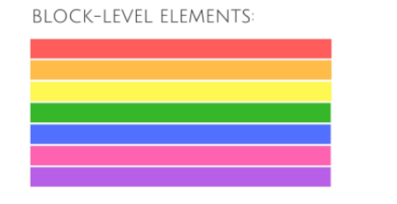

## Layout 

#### We will Cover The following :
*In this chapter we are going to learn  how to control where each element sits on a page and how to create attractive page layouts.*
* **Controlling the position of elements.**
* **creating site layout.**
* **Designing for different sized screens.**

Position Concept: 
* Css treat each element in html doc. as a  box, this box could be a block level box so will sit and take the whole area or the whole width and start on a new line. or it could be inline box and these boxes flow in between surrounding  text and you can manage the spaces that this box will sit on it, by some   properities (width, height, padding, margin, borders).
* If one block-level element sits inside another block-level element then the outer box is
  known as the containing or parent element.

* Controling the layout of page  will be by using positioning schemes in differents ways: normal, relative absolute, static, ...

* devices have diffrenets screen sizes, So the web disginer should take the different layouts grids into considreation.

***Summary:***

- 
 elements are often used as containing elements to group together sections of a page.
- Browser display pages in normal flow, unless you changed the position for another value.
- float property can float the content of the container to the left or to the right, and it needs a clear property after using it avoiding to transfer the floating affect to the next elements. and we need to define the width when we use float property to see the affect.
- Pages can be fixed width or liquid (stretchy) layouts. 
- Designers keep pages within 960-1000 pixels wide, and indicate what the site is about within the top 600
pixels (to demonstrate its relevance without scrolling).
- Using grids we can create profassional and flexable designs.
- CSS Frameworks provide rules for common tasks.
- You can make a multiple css files and see their affect in one page. 

