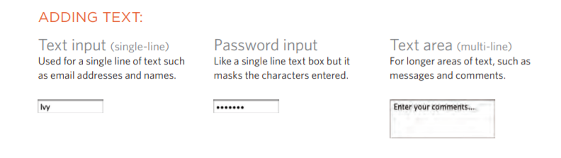

# HTML Forms 

- **How to create a form on your website**
- **The different tools for collecting data**
- **New HTML5 form controls**

*The best example for the forms on the web is probably the search box that sits right in the middle of Google's homepage.*

#### Form Controls
There are several types of form controls that you can use to collect information from the users to your site.

#### How The Forms work 

The structure of the forms :

<form>
Form controls live inside a <form> element. This element should always carry the action attribute and will usually have a method and id attribute too.

action
Every <form> element requires an action attribute. Its value is the URL for the page on the server that will receive the information in the form when it is submitted.

method
Forms can be sent using one of two methods: get or post. With the get method, the values from the form are added to the end of the URL specified in the action attribute

With the post method the values are sent in what are known as HTTP headers
- The defualt method is (get), if we did not add it.
id
We look at the id attribute on page 183, but the value is used to identify the form distinctly from other elements on the page (and
is often used by scripts — such as those that check you have entered information into fields that require values).

<input>
The <input> element is used to create several different form controls. The value of the type attribute determines what kind
of input they will be creating. 
type="text"
When the type attribute has a value of text, it creates a singleline text input.
name
When users enter information into a form, the server needs to know which form control each piece of data was entered into. (For example, in a login form, the server needs to know what has been entered as the username and what has been given as the password.) Therefore, each form control requires a name attribute. The value of this attributeidentifies the form control and is sent along with the information they enter to the server.

<input>
type="password"
When the type attribute has a value of password it creates a text box that acts just like a single-line text input, except the characters are blocked out. They are hidden in this way so that if someone is looking over the user's shoulder, they cannot see sensitive data such as passwords.
name
The name attribute indicates the name of the password input, which is sent to the server with the password the user enters.

<textarea>
The <textarea> element is used to create a mutli-line text input. Unlike other input
elements this is not an empty element. It should therefore have
an opening and a closing tag. Any text that appears between the opening <textarea> and
closing </textarea> tags will appear in the text box when the page loads.
If the user does not delete any text between these tags, this
message will get sent to the server along with whatever the user has typed. (Some sites use JavaScript to clear this
information when the user clicks in the text area.)

<input>
type="checkbox"
Checkboxes allow users to select (and unselect) one or moreoptions in answer to a question.
name
The name attribute is sent to the server with the value of the option(s) the user selects. Whena question provides users with options for answers in the form of checkboxes, the value of the name attribute should be the same for all of the buttons that answer that question.
value
The value attribute indicates the value sent to the server if this checkbox is checked. checked The checked attribute indicates that this box should be checked when the page loads. If used, its value should be checked

**Summary (forms)** 
- Whenever you want to collect information from visitors you will need a form, which lives inside a <form> element.

- Information from a form is sent in name/value pairs.

- Each form control is given a name, and the text the user types in or the values of the options they select are sent to the server.

- HTML5 introduces new form elements which make it easier for visitors to fill in forms.

### Lists Tables & Forms CSS

- Specify the type of bullet point or numbering on lists
- Add borders and backgrounds to table cells
-  Control the appearance of form controls

**Bullet Point Styles:**
list-style-type
This property allows you to control the shape or style of a bullet point (also known as a marker)

It can be used on rules that apply to the <ol>, <ul>, and <li> elements

Unordered Lists
For an unordered list you can use the following values:
 none
 disc
 circle
 square

Ordered Lists
For an ordered (numbered) list you can use the following values:
decimal
1 2 3
decimal-leading-zero
01 02 03
lower-alpha
a b c
upper-alpha
A B C
lower-roman
i. ii. iii.
upper-roman
I II III

*You can use list-style-image to add an image as style as well.*

list-style-position
You can make the numbered lists (its number) outside or inside the block, you need to have a border to your block to notice the differences.
**Here we can write the list style in one line:**
list-style: inside circle;

Table properties :
Padding, margin, width, height, position, :hover, bckground-color, border-spacing, border-collapse

Styling Forms: 

CSS is commonly used to control the appearance of form elements. This is both to make them more attractive and to make them more consistent across different browsers It is most common to style:
- Text inputs and text areas
- Submit buttons
- Labels on forms, to get the form controls to align nicely

**Summary**
*LISTS, TABLES AND FORM*

- In addition to the CSS properties covered in other chapters which work with the contents of all elements, there are several others that are specifically used to control the appearance of lists, tables, and forms.

- List markers can be given different appearances using the list-style-type and list-style image properties.

- Table cells can have different borders and spacing in different browsers, but there are properties you can use to control them and make them more consistent

- Forms are easier to use if the form controls are vertically aligned using CSS.

- Forms benefit from styles that make them feel more interactive.

#### Event

Here is a selection of the events that occur in the browser while you are browsing the web. Any of these events can be used to trigger a function in your JavaScript code. 
(load, unload, error, resize, scroll, keydown,keyup,...).

When an event has occurred, it is often described as having fired or been raised. In the diagram on the right, if the user is tapping on a link, a click event would fire in the browser. 

HOW EVENTS TRIGGER JAVASCRIPT CODE 

When the user interacts with the HTML on a web page, there are three steps involved in getting it to trigger some JavaScript code.
Together these steps are known as event handling. 

1. Select t he element node(s) you want the script to respond to.
2. Indicate which event on the selected node(s) will trigger the response.
3. State the code you want to run when the event occurs.  

Here you can see how event handling can be used to provide feedback to users filling in a registration form. It will show an error message if their username is too short. 

1. SELECT ELEMENT 
2. SPEC! FY EVENT 
3. CALL CODE 

**Notes:**
- Events are the browser's way of indicating whe something has happened (such as when a page has finished loading or a button has been clicked). 

- Binding is the process of stating which event you are waiting to happen, and which element you are waiting for that event to happen upon. 

- When an event occurs on an element, it can trigger a JavaScript function. When this function then changes the web page in some way, it feels interactive because it has responded to the user. 

- You can use event delegation to monitor for events that happen on all of the children of an element. 

