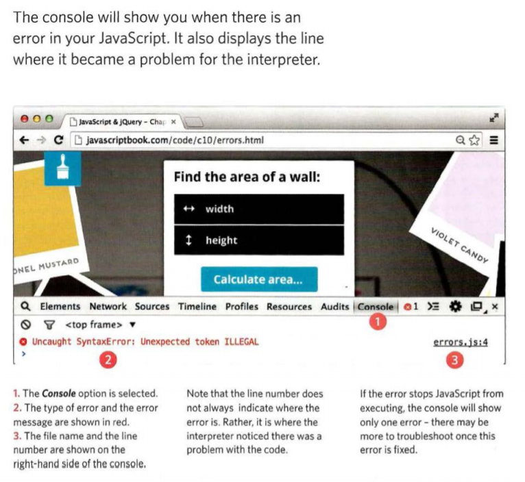

# Error Handling & Debugging

JavaScript can be hard to learn and everyone makes mistakes when writing it. This part will help you learn how to find the errors in your code. It will also teach you how to write scripts that deal with potential errors gracefully. 

We are Covering the following : 

1. THE CONSOLE & DEV TOOLS

*Tools built into the browser that help you hunt for errors.*

2. COMMON PROBLEMS

*Common sources of errors, and how to solve them.*

3. HANDLING ERRORS

*How code can deal with potential errors gracefully.* 

Firstly, **The order of execution** The order that your codes or your statements run, it is very important to know how it goes, but some of
these codes will be complex and hard to track the execution order.

**Excution Context**
We need to know that there is one global execution context and every function creates a new execution context. 

**The Stack** 
That is mean when a function need a variable or some statements from another functions, it stacked this task on top and make the other tasks on hold.

- EXECUTION CONTEXT & HOISTING 
There are two execution phases every time a script runs:
1. prepare
2. execute
- UNDERSTANDING SCOPE
- UNDERSTANDING ERRORS 

#### HOW TO DEAL WITH ERRORS 
1. You need to track every statement to debug your script.
2. gracfully, handle the errors: Try to narrow the problem where might be to ease tracking it.

**Notes**
- undefined errors: for properties, functions, variable.
- null error : for objects only.

***Summary:***

* > If you understand execution contexts (which have two stages) and stacks, you are more likely to find the error in your code. 

* > Debugging is the process of finding errors. It involves a process of deduction. 

* > The console helps narrow down the area in which the error is located, so you can try to find the exact error. 

* > JavaScript has 7 different types of errors. Each creates its own error object, which can tell you its line number and gives a
    description of the error. 

* > If you know that you may get an error, you can handle it gracefully using the try, catch, finally statements. Use them to give your
    users helpful feedback.

