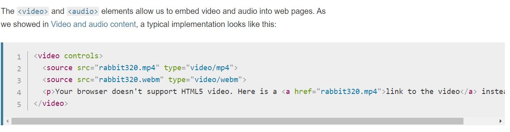

## Css / Images :

**controlling sizes of images:**
*It is available to control the size of your images by using some properties such as width and height, The same as when we change the size of boxes.*

**Aligning images:**
*Using float property with the margin property we can control the images alignments*

**Centering Images:**
*Images by default are inline elements, to center them we need to display it as a block or inline-blok, then we can manage the margin to center it and sometimes we need to make its width smaller if it was taking the whole width*

**Background-Image**
*this property using to be a put an image as a background for an element, and we can put it for the whole page.

**background-repeat**
1. repeat:
The background image is repeated both horizontally and vertically (the default way it is shown if the backgroundrepeat property isn't used).

2. repeat-x: 
The image is repeated horizontally only (as shown in the first example on the left).

3. repeat-y: 
The image is repeated vertically only.

4. no-repeat:
The image is only shown once.

5. fixed
The background image stays in the same position on the page.

6. scroll
The background image moves up and down as the user scrolls up and down the page.

**background-position**
When an image is not being repeated, you can use the background-position property to specify where in the
browser window the background image should be placed.

*This property usually has a pair of values. The first represents the horizontal position and the second represents the vertical.*

**Controlling the images in one line**
- background-color
- background-image
- background-repeat
- background-attachment
- background-position

**Summary** 

- You can specify the dimensions of images using CSS. This is very helpful when you use the same sized images on several pages of your site.
- Images can be aligned both horizontally and vertically using CSS.
- You can use a background image behind the box created by any element on a page. 
- Background images can appear just once or be repeated across the background of the box. 
- You can create image rollover effects by moving the background position of an image.
- To reduce the number of images your browser has to load, you can create image sprites.

## Practical Information

**Search Engine Optimization (SEO)**

The idea behind the huge topc above, is trying  to help your site to appear close to the top of search engin results, when people search for a topic your site cover it.

On-page techniques: are the methods you can use on your web pages to improve their rating in search engines.

Off-Page Techniques:
Getting other sites to link to you is just as important as on-page techniques. Search engines help
determine how to rank your site by looking at the number of other sites that link to yours.

**Summary**

* Search engine optimization helps visitors find your sites when using search engines.

* Analytics tools such as Google Analytics allow you to see how many people visit your site, how they find it, and  what they do when they get there.

* To put your site on the web, you will need to obtain a domain name and web hosting.

* FTP programs allow you to transfer files from your local computer to your web server.

* Many companies provide platforms for blogging, email newsletters, e-commerce and other popular website
tools (to save you writing them from scratch).

## Flash, Video & Audio

We are covering : 

1. How to add Flash movies into your site.

2. How to add video and audio to your site.

3. HTML5 <video> and <audio> elements.

Whether you are creating an animation or a media player in Flash, the files you put on your website are referred to as Flash movies. 

Since 2005, a number of factors have meant that fewer websites are written in Flash or even use elements of Flash in their pages.

And the following figuer illustrates how to add a video into your website 

